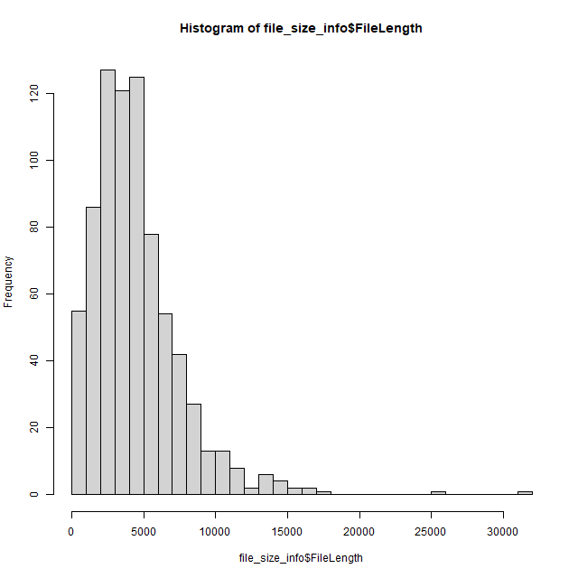

## dotnet で データを前処理した後で R でグラフを作る
dotnet と R の得意分野を組み合わせてデータを解析します。

dotnet : フォルダの中から ファイルを探してそのファイルサイズを取得
R : ヒストグラムを表示

### 手順

```
dotnet new console
```

dotnet の コード （指定のフォルダにあるファイルのサイズを求める）
```
static void Main(string[] args)
{
    // 指定ディレクトリにあるファイルのサイズ一覧
    string dir = @"c:\work";
    if (args.Length > 0 && Directory.Exists(args[0])) {
        // パラメータでディレクトリ指定可能
        dir = args[0];
    }
    Console.WriteLine("FileName\tFileLength");
    foreach(var file in Directory.GetFiles(dir, "*.txt")) {
        string fileName = Path.GetFileName(file);
        FileInfo f = new FileInfo(file);
        Console.WriteLine($"{fileName}\t{f.Length}");
    }
}
```

R でヒストグラムを作成する
```
# 入力パラメータをファイル名とする
args <- commandArgs(trailingOnly = TRUE)
file_name <- args[1];

print(file_name)

# 先頭をタイトルとして解析
file_size_info <- read.delim(file_name, row.names = 1)

png("info.png", 640, 640)
hist(file_size_info$FileLength, breaks = 30)
dev.off()
```

コマンドプロンプトで 以下を実施
```
dotnet run > file_size_info.tsv
Rscript view.R file_size_info.tsv
```

これでこのような画像が生成される



### うまくいかない場合


パスが通ってなくて Rscript が起動できない場合
Windows の場合
```
set PATH="C:\Program Files\R\R-4.0.0\bin";%PATH%
```

git bash の場合
```
export PATH='/c/Program Files/R/R-4.0.0/bin':$PATH
```


